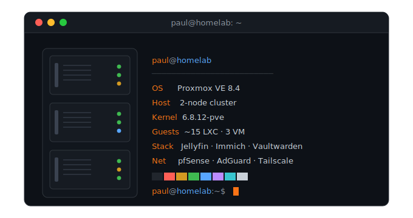

<!-- ─────────────────────────────  HEADER  ───────────────────────────── -->

 

<!-- ─────────────────────────────  TERMINAL / ABOUT  ───────────────────────────── -->

  

<!-- ─────────────────────────────  HOMELAB  ───────────────────────────── -->
## 🏠 The Homelab

> A 2-node **Proxmox** cluster running ~15 services I actually use every day.

  
  
  

  
  
  
  

  
  
  
  

<!-- ─────────────────────────────  STACK  ───────────────────────────── -->
## 🛠️ Tech & Tools

  
  
  
  
  

  

<!-- ─────────────────────────────  SNAKE  ───────────────────────────── -->
## 🐍 Watch the snake eat my contributions

  <picture>
    <source media="(prefers-color-scheme: dark)" srcset="https://raw.githubusercontent.com/PJinda168/PJinda168/output/github-contribution-grid-snake-dark.svg" />
    <source media="(prefers-color-scheme: light)" srcset="https://raw.githubusercontent.com/PJinda168/PJinda168/output/github-contribution-grid-snake.svg" />
    
  </picture>

